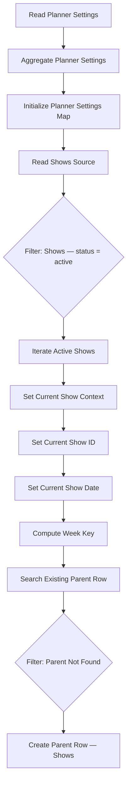

# Weekly Planner V2 — Shows Flow (v1.15)

```mermaid
flowchart TD
  %% Weekly Planner V2 — Shows slice (from Module Inventory v1.15)
  A[Read Planner Settings]
  B[Aggregate Planner Settings]
  C[Initialize Planner Settings Map]
  D[Read Shows Source]
  E{Filter: Shows — status = active}
  F[Iterate Active Shows]
  G[Set Current Show Context]
  H[Set Current Show ID]
  I[Set Current Show Date]
  J[Compute Week Key]
  K[Search Existing Parent Row]
  L{Filter: Parent Not Found}
  M[Create Parent Row — Shows]

  A --> B --> C --> D --> E --> F --> G --> H --> I --> J --> K --> L --> M

```
